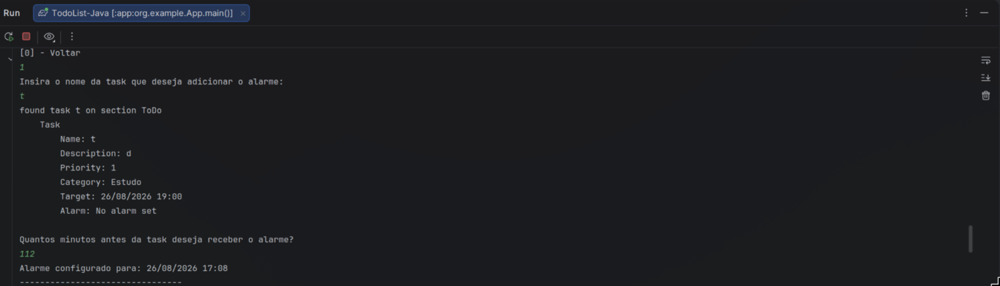
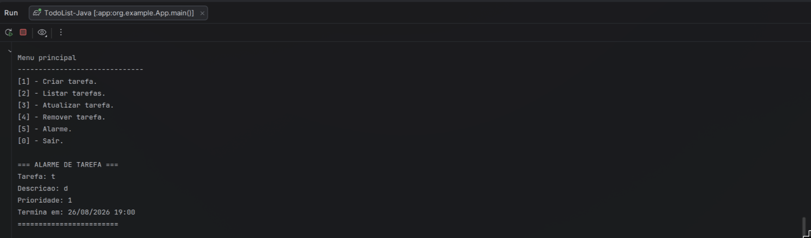

# TodoList-Java
> Aplicação ToDo em **Java, utilizando a ferramenta de build Gradle.**

- **Trello Board: https://trello.com/b/sqmuyMWr**
## funcionalidades
1. Criar tarefas passando nome, descrição, prioridade, categoria(opcional) e data de término.
2. Listar tarefas por status, prioridade ou categoria.
3. Mover tarefas entre os status ToDo, Doing e Done.
4. Remover tarefas.
5. Configurar Alarmes para tarefas

## Alarme de tarefa
Ao criar um alarme, o usuário **informa quantos minutos antes da tarefa ele deseja ser alertado sobre ela. Por exemplo, se ela termina em 26/08/2026 16:00 e o usuário informar '120' minutos,o alarme será configurado para '26/08/2026 14:00' **


> **Atenção**: tarefas concluidas com status `Done` não disparam alarmes.

## Estrutura principal

- `App.java`: controla o menu principal e o fluxo de criação/listagem de alarmes.
- `Task.java`: representa uma tarefa e armazena o horário do alarme.
- `Alarm.java`: verifica periodicamente se algum alarme deve ser disparado.
- `Board.java`: mantém e organiza as tarefas.
- `BoardPrinter.java`: centraliza a impressão das tarefas no console.

## Como executar
```bash
./gradlew run
```
## Bibliotecas e classes utilizadas

- **DateTimeFormatter:** para definir,validar e formatar datas.
- **ResolverStyle**: utilizado junto com o `DateTimeFormatter` para validar datas de forma mais rígida, evitando datas inválidas como `31/02/2026`.
- **LocalDateTime**: utilizado para representar datas e horários das tarefas e dos alarmes.
- **Scanner**: utilizado para ler as entradas do usuário pelo terminal.
- **Jackson Databind**: utilizado para carregar e interpretar o arquivo JSON do menu da aplicação.

## Estrutura de pastas````

```text
app/src/main/java/  Estrutura geral do projeto
```

## Estrutura de pacotes

- `org.example`: pacote principal da aplicação. Contém as classes centrais do TODO List, como `App`, `Board`, `Task`, `Alarm` e `User`.
- `org.example.cli`: pacote responsável pela estrutura do menu exibido no console. Contém classes como `TodoConsole`, `Menu`, `MenuItem` e `MenuConfig`.
- `org.example.cli.printer`: pacote responsável pela impressão das informações no terminal. Contém classes como `BoardPrinter` e `MenuPrinter`.

## Classes principais

- `App`: ponto de entrada da aplicação e responsável pelo fluxo principal do menu.
- `Board`: representa o quadro de tarefas e gerencia adição, remoção, busca, listagem e movimentação das tasks.
- `Task`: representa uma tarefa, incluindo título, descrição, prioridade, categoria, status, data de término e alarme.
- `Alarm`: verifica periodicamente se alguma tarefa possui alarme no horário definido e dispara o aviso no console.
- `BoardPrinter`: centraliza a exibição das tarefas no terminal.


